## Contributing

## Architecture

Schednex is a drop in replacement for the Kubernetes default scheduler.
It will only be utilised by workloads that name `schedulerName: Schednex`

You can see the architecture of Schednex below:



### Getting setup

1. Clone this repository and K8sGPT
2. Install the test cluster with `kind` and the command `make cluster-up`
3. Run K8sGPT locally e.g. `go run main.go serve`
4. Run the scheduler locally e.g. `LOCAL_MODE=on go run main.go`
5. Test it with a pod e.g. `kubectl apply -f examples/example-pod.yaml`

## DCO
We have a DCO check which runs on every PR to verify that the commit has been signed off.

To sign off the last commit you made, you can use

```
git commit --amend --signoff
```

You can also automate signing off your commits by adding the following to your `.zshrc` or `.bashrc`:

```
git() {
  if [ $# -gt 0 ] && [[ "$1" == "commit" ]] ; then
     shift
     command git commit --signoff "$@"
  else
     command git "$@"
  fi
}
```

## Semantic commits
We use [Semantic Commits](https://www.conventionalcommits.org/en/v1.0.0/) to make it easier to understand what a commit does and to build pretty changelogs. Please use the following prefixes for your commits:
- `feat`: A new feature
- `fix`: A bug fix
- `chore`: Changes to the build process or auxiliary tools and libraries such as documentation generation
- `ci`: Changes to our CI configuration files and scripts
- `docs`: Documentation changes
- `refactor`: A code change that neither fixes a bug nor adds a feature
- `test`: Adding missing tests or correcting existing tests

An example for this could be:
```
git commit -m "docs: add a new section to the README"
```
