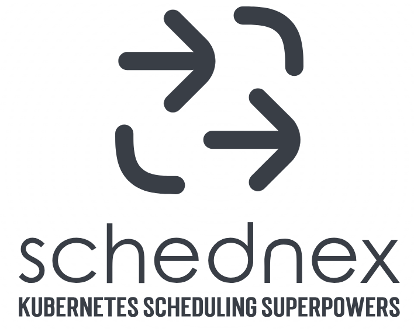

A custom Kubernetes scheduler that uses insights from K8sGPT, powered by AI. 
Enabling the smartest placement of your workloads.

## Requirements

- k8sgpt-operator installed with a deployed K8sGPT custom resource
  - k8sgpt resource must have AI enabled and using the `openai` backend
  - **K8sGPT v0.3.41 and later**
  - Disable caching `noCache: true` within the K8sGPT CR
- Metrics Server installed in the cluster:
  - `kubectl apply -f https://github.com/kubernetes-sigs/metrics-server/releases/latest/download/components.yaml`

## Installation
- Install K8sGPT operator with [this guide](https://github.com/k8sgpt-ai/k8sgpt-operator?tab=readme-ov-file#installation)

- Install the scheduler:
```
helm repo add schednex-ai https://schednex-ai.github.io/charts/
helm repo update
helm install release schednex-ai/schednex -n kube-system
```